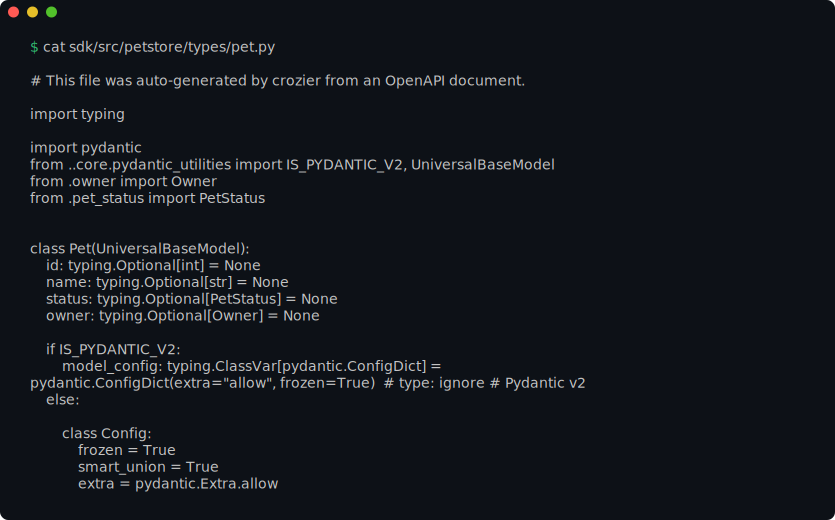
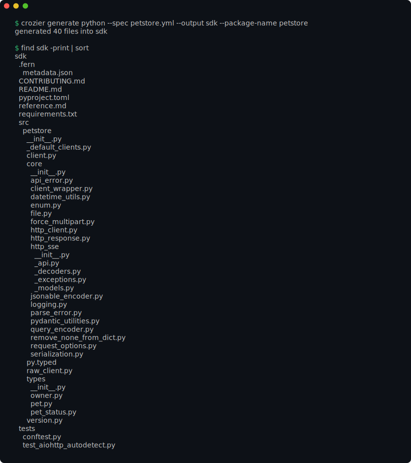
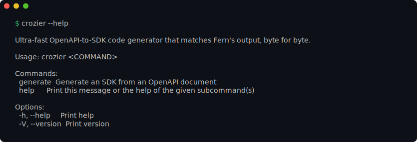
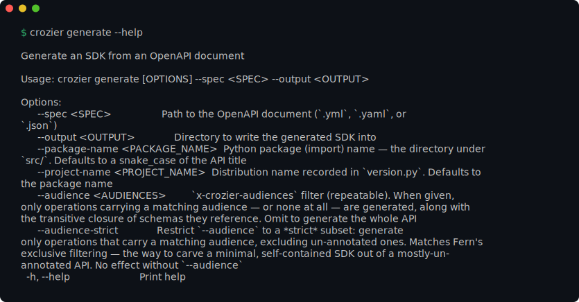

# crozier

An ultra-fast, memory-efficient OpenAPI-to-SDK code generator written in Rust +
[minijinja](https://github.com/mitsuhiko/minijinja). crozier reproduces
[Fern](https://github.com/fern-api/fern)'s generated SDKs **byte-for-byte** (with
generator-identifying comments aside), driven by nothing but an OpenAPI document
and a couple of naming flags — no per-project config, no generators written in the
target language.

Python is the only target today; more will follow.

> **Status:** early. crozier generates the Python **type layer** (pydantic models,
> enums, unions/aliases) plus `version.py`/`py.typed`, and byte-matches Fern's
> output for those files. See [`docs/matching.md`](docs/matching.md) for exactly
> what is matched and the roadmap.

## See it in action

One OpenAPI document in, a complete typed Python SDK out — `crozier generate`
writes the whole package in one shot, then you can read the code it produced:


The output is byte-for-byte Fern's. Here is the `Pet` model crozier emitted from a
handful of lines of schema — a real generated file, not a hand-written sample:



`crozier generate` takes the document and a couple of naming flags and writes the
SDK — the models, enums, the per-endpoint client, and Fern's `core/` runtime —
into `--output`:



<details>
<summary>The full command surface (<code>crozier --help</code> and <code>crozier generate --help</code>)</summary>





</details>

A malformed document is rejected at the boundary with an actionable message and a
non-zero exit — never a panic:


> These are real captures of the CLI, rendered from its actual output by
> [`just screenshots`](screenshots/AGENTS.md) and gated by
> [screencomp](https://github.com/nickderobertis/screencomp) — change what a
> command prints and the committed image (and its digest) changes with it.

## Install

**From PyPI (fastest — a prebuilt binary, no Rust toolchain):** crozier ships as
platform wheels that wrap the compiled binary and expose it as a console script,
so any Python installer puts it on your `PATH` in seconds:

```sh
pip install crozier      # or: pipx install crozier
uvx crozier --help       # run once without installing
```

Platforms without a prebuilt wheel fall back to the source distribution, which
builds from Rust (a toolchain is needed there).

**From crates.io:**

```sh
cargo install crozier --locked
```

**From the install script (prebuilt binary from GitHub Releases, verified):**

```sh
curl -fsSL https://raw.githubusercontent.com/nickderobertis/crozier/main/scripts/install.sh | sh
```

It detects your platform, downloads the matching archive, and verifies it against
a trust root independent of where it was downloaded — a Sigstore build-provenance
attestation when a verifier (`cosign`, `pip install sigstore`, or `gh`) is
present, else the canonical SHA-256 checksum. Pin a version or install location
with `sh -s -- --version v0.1.0 --to ~/.local/bin`.

**From source (latest `main`):**

```sh
cargo install --git https://github.com/nickderobertis/crozier --locked
```

**From a release archive (manual):** each release publishes per-platform archives
named `crozier-<tag>-<target>.tar.gz` with a matching `.sha256` and a
`.sigstore.json` provenance bundle, for targets `x86_64`/`aarch64` Linux,
`x86_64`/`aarch64` macOS, and `x86_64` Windows. Download the archive for your
platform from the
[Releases](https://github.com/nickderobertis/crozier/releases) page, verify the
checksum (or the attestation), and put the `crozier` binary on your `PATH`.

## Usage

The fastest path needs no config file — the built-in `python` generator runs
straight from flags:

```sh
crozier generate python \
  --spec path/to/openapi.yml \
  --output ./generated \
  --package-name my_api \
  --project-name my-api
```

- `--spec` — the OpenAPI 3.x document (`.yml`, `.yaml`, or `.json`).
- `--output` — directory to write the SDK into.
- `--package-name` — the Python import package (the directory under `src/`).
  Defaults to a `snake_case` of the API title.
- `--project-name` — the distribution name recorded in `version.py`. Defaults to
  the package name.
- `--client-class-name` — the name of the generated root client class (Fern's
  `client_class_name`). Defaults to `{PascalCase(package_name)}Api`.
- `--audience` (repeatable) / `--audience-strict` — prune generation to
  `x-crozier-audiences`.

crozier exits `0` on success (with a one-line summary on stderr) and `1` on any
error, printing the exact problem and a suggested fix.

## Configuration

crozier runs one or more **named generators**. You can drive them purely from
flags (above), from a `crozier.yml`, or any mix — every setting resolves per
field as:

```text
CLI flag  >  CROZIER_* env var  >  crozier.yml (generator over shared)  >  built-in default
```

Run `crozier init` to drop a starter `crozier.yml` in the working directory. It
leads with a JSON Schema modeline —

```yaml
# yaml-language-server: $schema=https://raw.githubusercontent.com/nickderobertis/crozier/main/assets/crozier.schema.json
```

— so editors with the YAML language server give **field completion and
validation** against the [published schema](assets/crozier.schema.json) (derived
from crozier's own config types, so it never drifts). Run `crozier config` to
print the effective settings and the layer each value came from.

A `crozier.yml` in the working directory is picked up automatically. Top-level
keys are shared defaults; each entry under `generators:` is one SDK to emit:

```yaml
# Shared across every generator
spec: ./openapi.yml
audiences: [public]

generators:
  python:              # overrides the built-in `python` generator
    output: ./sdks/python
    package-name: my_api
    project-name: my-api
  admin:               # a second generator (also Python for now)
    type: python
    spec: ./admin-openapi.yml
    output: ./sdks/admin
    package-name: admin_api
```

- `crozier` or `crozier generate` — run **every** configured generator (or the
  built-in `python` when nothing is configured).
- `crozier generate <name>` — run one generator by name (`python` always works,
  even with no config file).
- `crozier init` — write a starter `crozier.yml` (`--output`, `--force`).
- `crozier config [<name>]` — show the effective config and each value's source.
- `crozier schema` — print the config JSON Schema to stdout.
- `--config <path>` (repeatable, later wins) selects config files instead of
  auto-discovery; `--no-config` ignores config files entirely; `CROZIER_CONFIG`
  names a file via the environment.

Per-generation flags (`--spec`, `--output`, …) apply to a single generator, so
they are rejected when more than one would run — name one, or set the values in
`crozier.yml`. See [`docs/configuration.md`](docs/configuration.md) for the full
reference.

## Development

The command surface is a small set of `just` recipes:

```sh
just bootstrap   # set up from a clean clone (toolchain + dev tools)
just check       # full gate: fmt, clippy -D warnings, tests + e2e + coverage, deny, machete, doc
just test        # fast tests with coverage enforced (95%)
just test-e2e    # drive the compiled binary and byte-compare against fixtures
just format      # rustfmt in place
just upgrade     # cargo update, then re-run the gate
```

See [`AGENTS.md`](AGENTS.md) for the durable contributor guide and
[`docs/matching.md`](docs/matching.md) for the byte-matching strategy.

## License and attribution

crozier is licensed under [Apache-2.0](LICENSE). It is an independent, clean-room
implementation — it reproduces Fern's generated *output* format (the project's
explicit goal) and does not copy Fern's generator source.

The test fixtures under `tests/fixtures/` are Fern's own output and OpenAPI test
specs, used under Apache-2.0 with attribution and a statement of changes; see
[`NOTICE`](NOTICE) and [`licenses/fern-APACHE-2.0.txt`](licenses/fern-APACHE-2.0.txt).
